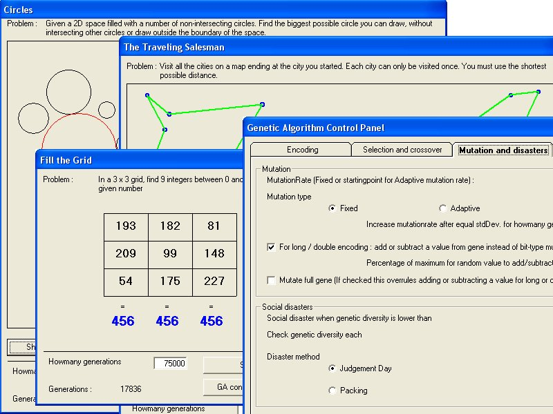



## Big Genetic Algorithm \- Problemsolver

### Description

This is a complete Genetic Algorithm Class full with all the features you will ever need.

If you are new to Genetic Algorithms you will find extensive documentation (both in code and in separate textfiles) to help you understand what it is and how it works. Just run the examples and make out for youself if you want to learn more. You can use this class in your own projects to help you solve many kinds of problems.

I provide 5 different examples to help you on your way.

These examples are :

- find the values in a formula

- draw the biggest circle

- fill a 3x3 grid so that rows and columns have the same sum

- 0/1 knapsack problem

- And of course : The traveling salesman

All examples are kept simple and have their own explanation-textfiles.

The list of features : (don't worry if you don't understand this at first, full explanation is provided in code and in separate textfiles)

Supported encoding types : Binary, Alphabetic, Long integer and Double (real numbers)

Selection methods : Rank, Roulette Wheel or Tournament

Crossover methods : One point, Two point, Uniform, Half-uniform or Edge recombination

Mutation : can be Fixed or Adaptive, numerical encoding can have mutation happen the usual way it's done with numbers, or bit-like

Reproduction methods : Replace weakest, replace parents or replace random.

Two Social disasters : Judgement Day or Packing

Also supports : Random-Offspring generation, Crossover and mutation on full-gene or anywhere in a gene (and this for all encoding types !!)

Let the class create it's own population or provide your own...

All these settings are easy to modify using the GA-control panel and can be saved/loaded from a file. Complete statistics can be kept during the generation cycles and saved to a file.

The only thing you need to do is choose an encoding type and provide a fitness function, my class does the rest.

I am open to questions, suggestions, remarks and constructive critisism.

Thierry

email : thierry.van.mol@hotmail.com
 
### More Info
 
Full documentation is provided about what is a genetic algorithm and how to use the class in one's own projects. However the user should understand how a GA works before using this class.

             |
---                |---
**Submitted On**   |2008-05-04 00:35:50
**By**             |[Thierry](https://github.com/Planet-Source-Code/PSCIndex/blob/master/ByAuthor/thierry.md)
**Level**          |Intermediate
**User Rating**    |5.0 (110 globes from 22 users)
**Compatibility**  |VB 6\.0
**Category**       |[Miscellaneous](https://github.com/Planet-Source-Code/PSCIndex/blob/master/ByCategory/miscellaneous__1-1.md)
**World**          |[Visual Basic](https://github.com/Planet-Source-Code/PSCIndex/blob/master/ByWorld/visual-basic.md)
**Archive File**   |[Big\_Geneti211159542008\.zip](https://github.com/Planet-Source-Code/thierry-big-genetic-algorithm-problemsolver__1-70492/archive/master.zip)

